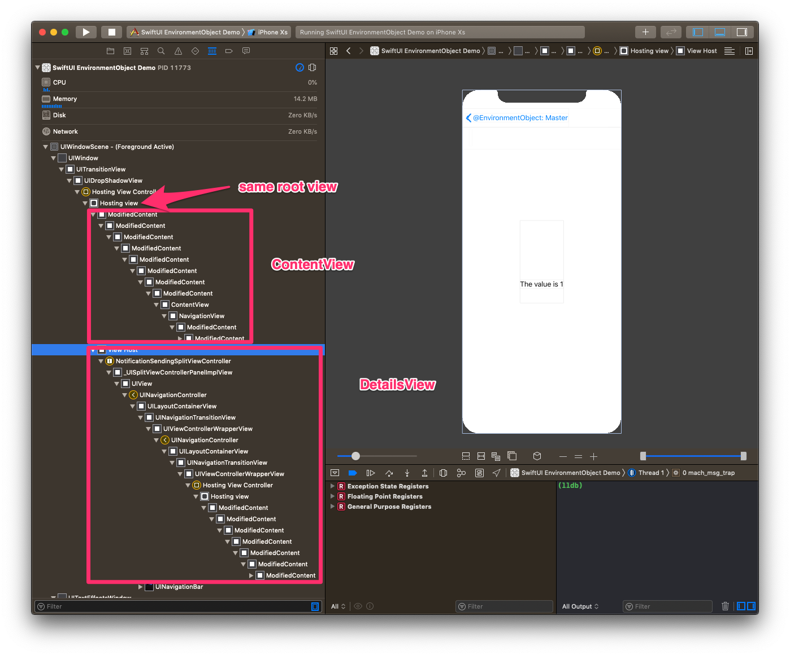

# SwiftUI @EnvironmentObject Demo

According to the SwiftUI documentation, `@EnvironmentObject` is _a dynamic view property that uses a bindable object supplied by an ancestor view to invalidate the current view whenever the bindable object changes_ ([source](https://developer.apple.com/documentation/swiftui/environmentobject)).

Essentially, you can use it to manage access to global state. [Hacking with Swift has a [great article](https://www.hackingwithswift.com/quick-start/swiftui/whats-the-difference-between-objectbinding-state-and-environmentobject) that explains the differences between `@State`, `@ObservableObject`, and `@EnvironmentObject`.

Particularly, it says _There’s a third type of property available to use, which is `@EnvironmentObject`. This is a value that is made available to your views through the application itself – it’s shared data that every view can read if they want to._

It turns out, however, that while values put into the environment nicely percolate down the view hierarchy, this is not the case for modals.

Let's assume the following code:

```swift
class AppState: ObservableObject {
  @Published var counter = 0
}

struct ContentView: View {
  @EnvironmentObject var state: AppState
  @State var presentDetailsView = false
  @State var presentDetailsViewNoEnvironment = false
  
  var body: some View {
    NavigationView {
      VStack {
        Button(action: { self.state.counter += 1 }) {
          Text("Current value: \(state.counter)")
        }

        // 1

        Button(action: { self.presentDetailsView = true }) {
          Text("Present details")
        }
        Button(action: { self.presentDetailsViewNoEnvironment = true }) {
          Text("Present details w/o Environment (will crash)")
        }
      }
      .navigationBarTitle("@EnvironmentObject: Master")
      // 2
    }
  }
}

struct DetailsView: View {
  @EnvironmentObject var state: AppState
  
  var body: some View {
    Text("The value is \(state.counter)")
  }
}
```

If you now insert the following code at location (1), you will see that you can navigate from the master view to the details view as expected, and the details view can access the `counter` state via the global environment:

```swift
        NavigationLink(destination: DetailsView()) {
          Text("Navigate to details")
        }
```

However, adding the following code at location (2) will result in a crash:

```swift
      .sheet(isPresented: $presentDetailsViewNoEnvironment) {
        DetailsView()
      }
```

```console
Fatal error: No observable object of type AppState.Type found.
A View.environmentObject(_:) for AppState.Type may be missing as an ancestor of this view.: file /BuildRoot/Library/Caches/com.apple.xbs/Sources/Monoceros_Sim/Monoceros-21.1.2/Core/EnvironmentObject.swift, line 171
```

Instead, in order to present the details view as a modal, you have to pass the `state` on, like so:

```swift
      .sheet(isPresented: $presentDetailsView) {
        DetailsView().environmentObject(self.state)
      }
```

Looking at the view hierarchy in the view debugger, we can see that thethis actually makes sense, as a modal screen is added to the view hierarchy **in parallel** to the original `ContentView`.

When navigating from `ContentView` to `DetailsView` using a `NavigationLink`, `DetailsView` becomes a child of `ContentView`:



When displaying a modal sheet using `sheet(isPresented:content:)`, however, `DetailsView` will not become a child of `ContentView`. Instead, the hosting view will be instantiated in parallel to the originating view.


